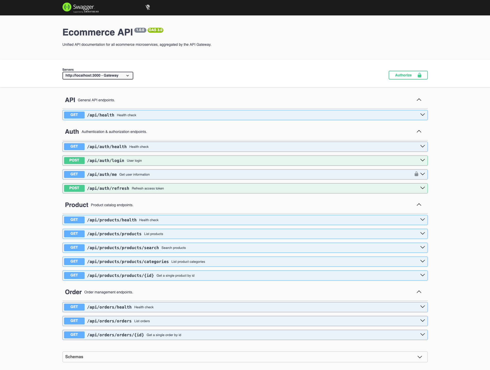

# ecommerce-rest-api

An ecommerce REST API built as independent microservices under [`services/`](services/).
Each service is a self-contained Node.js (ESM) Express app with its own
`package.json`, `.env`, and `node_modules` — there is **no shared/workspace
dependency tree**. The root [`package.json`](package.json) is orchestration-only
(`concurrently` + `npm --prefix` scripts).

| Service | Port | Path prefix (via gateway) | Responsibility |
|---------|------|---------------------------|----------------|
| [`api-gateway`](services/api-gateway/) | 3000 | — | Entry point; reverse-proxies traffic and aggregates OpenAPI docs |
| [`auth-service`](services/auth-service/) | 3001 | `/api/auth` | Authentication & authorization (JWT) |
| [`product-service`](services/product-service/) | 3002 | `/api/products` | Product catalog |
| [`order-service`](services/order-service/) | 3003 | `/api/orders` | Order management |

Every service mounts its router at `/api` and answers `GET /api/health` directly.
Through the gateway those become `GET /api/auth/health`, `GET /api/products/health`, etc.

> Architecture deep-dive: [CLAUDE.md](CLAUDE.md) · Deploy details: [DEPLOYMENT.md](DEPLOYMENT.md)



> **Try it live** — the full stack is deployed on Render:
> [open the aggregated Swagger UI](https://api-gateway-22ik.onrender.com/api-docs)
> and hit **Authorize** with the demo credentials `guest` / `test12345`.

## Endpoints

Everything is reachable through the gateway on port `3000` under the `/api`
prefix. Responses are JSON; list endpoints return a paginated envelope — the
items array plus `total`, `skip` and `limit` (dummyjson-style).

| Method | Endpoint | Description |
|--------|----------|-------------|
| `POST` | `/api/auth/login` | Log in; returns the user profile + access & refresh tokens |
| `GET`  | `/api/auth/me` | Current user (requires `Authorization: Bearer <token>`) |
| `POST` | `/api/auth/refresh` | Rotate the refresh token for a fresh token pair |
| `GET`  | `/api/products` | List products — `limit`, `skip`, `category`, `sortBy`, `order` |
| `GET`  | `/api/products/search` | Full-text search — `query` (or `q`), plus sort & pagination |
| `GET`  | `/api/products/categories` | List product categories |
| `GET`  | `/api/products/{id}` | Single product by id |
| `GET`  | `/api/orders` | List orders — `limit`, `skip`, `userId`, `status` |
| `GET`  | `/api/orders/{id}` | Single order by id |
| `GET`  | `/api/{service}/health` | Health check for any service |

The mock dataset is **50 products** across 7 categories (beauty, electronics,
fashion, fragrances, groceries, home, sports), **25 orders**, and **10 users**
(all share the password `test12345`, e.g. `guest` / `test12345`).

## Using the API

The base URL is the gateway — `http://localhost:3000` locally, or the
[live demo](https://api-gateway-22ik.onrender.com) on Render.

### Authenticate

```bash
curl -X POST http://localhost:3000/api/auth/login \
  -H 'Content-Type: application/json' \
  -d '{ "username": "guest", "password": "test12345" }'
```

```jsonc
{
  "id": 10,
  "username": "guest",
  "email": "guest@example.com",
  "firstName": "Guest",
  "lastName": "User",
  "accessToken": "eyJhbGciOiJIUzI1NiIsInR5cCI6IkpXVCJ9...",
  "refreshToken": "eyJhbGciOiJIUzI1NiIsInR5cCI6IkpXVCJ9..."
}
```

Send the access token as a Bearer header to reach protected routes:

```bash
curl http://localhost:3000/api/auth/me \
  -H 'Authorization: Bearer <accessToken>'
```

### List, paginate, filter & sort products

```bash
# 10 products, skipping the first 20
curl 'http://localhost:3000/api/products?limit=10&skip=20'

# only the "electronics" category, most expensive first
curl 'http://localhost:3000/api/products?category=electronics&sortBy=price&order=desc'
```

```jsonc
{
  "products": [ /* … */ ],
  "total": 50,
  "skip": 20,
  "limit": 10
}
```

> `limit=0` returns every remaining item. The same `limit` / `skip` / `sortBy` /
> `order` params also work on `/api/products/search` and `/api/orders`.

### Search products

```bash
curl 'http://localhost:3000/api/products/search?q=mascara'
```

### Filter orders

```bash
# delivered orders placed by user 1
curl 'http://localhost:3000/api/orders?userId=1&status=delivered'
```

## Local development

### Option A — run everything with Node (fastest inner loop)

```bash
npm run install:all   # install root + all four services
cp services/auth-service/.env.example services/auth-service/.env    # per service, first time
npm run dev           # run all four with node --watch (color-prefixed logs)
# or: npm start       # plain node, no watch
```


Copy `.env.example` → `.env` in each service before the first run (defaults match
the ports above). There is **no test runner or linter** — every `npm test` is a
placeholder that exits 1.

### Option B — run the full stack in Docker (mirrors production topology)

```bash
docker compose up --build
```

Brings up the gateway + three services with health-gated `depends_on`. There is
no database container — persistence is a file-based mock in the repo-root
`database/` folder (see below).

### Per-service (from within `services/<name>/`)

```bash
npm install
npm run dev        # node --watch, auto-restarts on change
npm start          # plain node index.js
```

### Handy URLs (local)

| URL | What |
|-----|------|
| http://localhost:3000/api-docs | Aggregated Swagger UI (all services, via gateway) |
| http://localhost:3000/api/auth/login | Auth login (seed creds: `guest` / `test12345`) |
| http://localhost:3001/api-docs | auth-service Swagger UI (direct) |
| `GET /api/health` on any port | Service health check |

## Deployment

Deploys go to [Render](https://render.com) as four Docker web services, triggered
by GitHub Actions on push to `master` (build every image → POST each service's
Render deploy hook, downstreams first, gateway last). `autoDeploy` is off. Full
setup — Render Blueprint, deploy hooks, secrets — is in [DEPLOYMENT.md](DEPLOYMENT.md).

## Adding a new service

A new service (say `payment-service` on port `3004`, prefix `/api/payments`)
touches both the local-dev wiring and the deploy wiring. Work through both
checklists — the gateway only sees a service once it's added to **all** of the
lists below.

### 1. Scaffold the service

- Create `services/payment-service/` following the identical per-service layout
  (`index.js`, `routes/index.js`, `config/swagger.js`, `config/schemas.js`) —
  see [CLAUDE.md](CLAUDE.md) for the layout and shared conventions (ESM, error
  shape `{ status, message, statusCode }`, health shape `{ status, service, uptime }`).
- Add `services/payment-service/.env.example` (with `PORT=3004`) and a
  multi-stage `services/payment-service/Dockerfile` (copy an existing one —
  **the build context is the repo root**, so paths are repo-relative).

### 2. Local dev wiring

- **[`package.json`](package.json)** — add the service to all three root scripts
  (`dev`, `start`, `install:all`), matching the `concurrently` name/color pattern.
- **[`docker-compose.yml`](docker-compose.yml)** — add a service block (build
  context `.`, dockerfile path, `PORT`, port mapping, healthcheck) and add it to
  the gateway's `AUTH_SERVICE_URL`-style env vars + `depends_on`.

### 3. Gateway wiring (so it's proxied and appears in aggregated docs)

- **[`services/api-gateway/config/proxy.js`](services/api-gateway/config/proxy.js)** —
  add `PAYMENT_SERVICE_URL` and a `{ prefix: "/api/payments", url: PAYMENT_SERVICE_URL }`
  entry to `TARGETS`.
- **[`services/api-gateway/config/swagger.js`](services/api-gateway/config/swagger.js)** —
  add `PAYMENT_SERVICE_URL` and a `DOWNSTREAM` entry (`tag`, `ns: "Payment_"`,
  `pathPrefix: "/api/payments"`, `url`, `description`). The `ns` namespaces the
  service's OpenAPI components so same-named schemas don't collide.

### 4. Deploy wiring

- **[`render.yaml`](render.yaml)** — add a `type: web` block for the new service
  (docker runtime, `dockerfilePath`, `dockerContext: .`, `healthCheckPath: /api/health`,
  `autoDeploy: false`, env vars). Add a `PAYMENT_SERVICE_URL` env var to the
  `api-gateway` block using `fromService … property: hostport`.
- **[`.github/workflows/deploy.yml`](.github/workflows/deploy.yml)** — add the
  service to the `build` matrix and add a deploy step (before the gateway step)
  that POSTs `secrets.RENDER_DEPLOY_HOOK_PAYMENT`.
- **Render + GitHub secrets** — after the Blueprint re-syncs the new service,
  grab its Deploy Hook and add `RENDER_DEPLOY_HOOK_PAYMENT` as a repo secret
  (see [DEPLOYMENT.md](DEPLOYMENT.md)).

### 5. Verify

```bash
docker compose up --build
# new service resolves through the gateway and shows up in the merged docs:
curl http://localhost:3000/api/payments/health
open http://localhost:3000/api-docs
```
